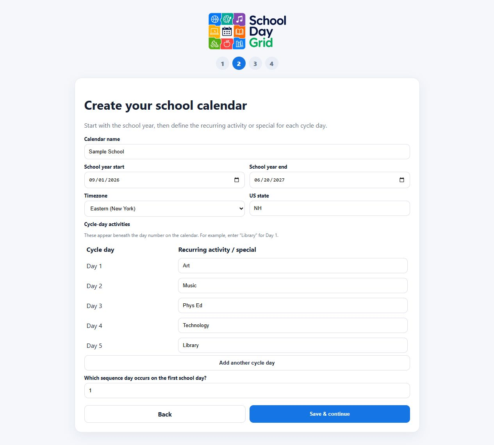
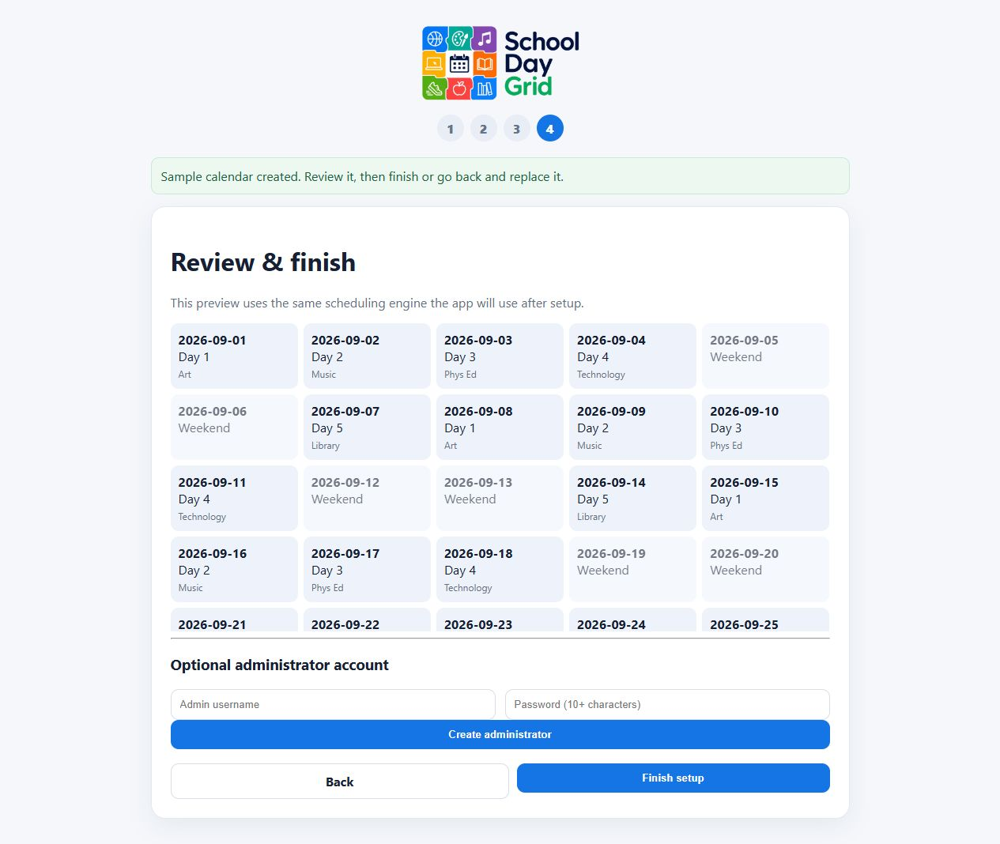

  

# School Day Grid

Keep an easy, reliable school-day calendar—even when holidays, snow days, and other closures interrupt the usual rotation.

School Day Grid is for schools and families that use rotating days such as A/B, 5-day, 6-day, or a cycle of their own. Set it up once, check today’s day at a glance, and share or subscribe to the finished calendar wherever it is useful.

## What it helps with

- Keep rotating days in the right order when school is closed.
- Add recurring specials such as Art, Music, Library, or anything else.
- Bring in known days off from a district calendar when you have one.
- Share a finished calendar or subscribe to it from another calendar app.
- Keep everything local by default. Home Assistant and other connections are optional.

## Start here

When you open School Day Grid for the first time, it guides you through four short steps:

1. Choose **Try a sample school year** to explore safely, or select **Get started** for your own calendar.
2. Name the calendar, choose the school-year dates, and enter the activities for each rotating day.
3. Optionally add known days off from your state or district calendar.
4. Review the result and finish. You can return to setup later to make changes.

### See the sample calendar in action

The sample has a five-day rotation with Art, Music, Phys Ed, Technology, and Library. It is a useful way to see how activities and dates fit together before entering real information.

After choosing the sample, the review screen shows the actual sequence, weekends, and a sample no-school day before anything is finalized.

## A few helpful notes

- You do not need to connect Home Assistant, MQTT, Google Calendar, Outlook, or any other service to use the app.
- Adding a district calendar is optional. You can skip it and add closures later.
- An administrator account is optional during setup.
- Back up the full calendar or export one calendar from the app whenever you want.

## Need to install or run it?

Follow the plain-language [installation and first-run guide](docs/GETTING_STARTED.md). It covers running School Day Grid on Windows, macOS, Linux, or Docker.

## More help

- [Import a district calendar](docs/ICS_IMPORT_GUIDE.md)
- [Optional Home Assistant integration](docs/HOME_ASSISTANT_OPTIONAL_INTEGRATION.md)
- [Technical reference for developers and self-hosters](docs/TECHNICAL_REFERENCE.md)

## Contributing and testing

If you are working on the application itself, see the [testing guide](docs/TESTING_GUIDE.md) and [technical reference](docs/TECHNICAL_REFERENCE.md).
